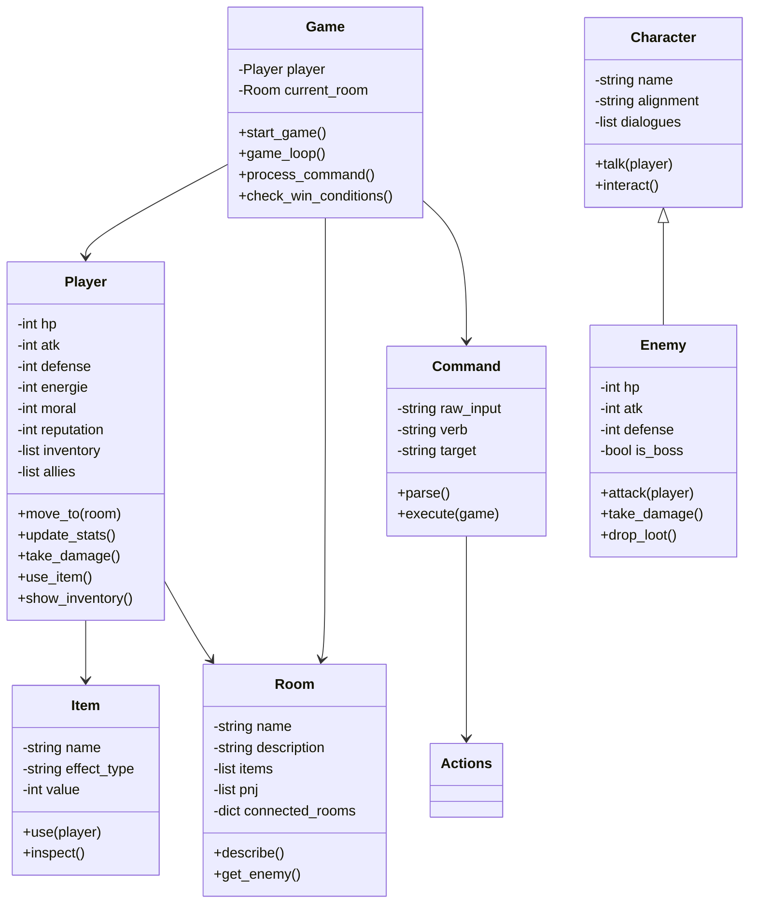

# 🌍 **THE STELLAR REBELLION — Chroniques d’ESIEE**

## 🎬 Présentation du jeu

En 2239, la Terre est ravagée par le réchauffement climatique.
L’école **ESIEE Paris**, dernier bastion de la connaissance scientifique, conçoit le vaisseau ***Vigilant***, destiné à découvrir une nouvelle planète habitable pour sauver l’humanité.

Mais une onde gravitationnelle inconnue frappe le vaisseau peu après son départ.
Son capitaine, **Orion Vale**, se réveille seul, échoué sur un monde inconnu.
Pour survivre et réparer le *Vigilant*, il devra **aider les peuples extraterrestres**, comprendre leurs civilisations et **rallier leurs forces** pour affronter les vestiges d’un empire humain déchu.

Le joueur incarne **le Commandant Orion Vale** et doit explorer plusieurs planètes, effectuer des choix moraux, combattre, récupérer des ressources et **décider du destin de l’humanité**.

---

## 🧭 Objectif du jeu

* Explorer les 4 planètes principales (Eridani Prime, Velyra IX, Lumae Delta, Kaos-7).
* Aider ou trahir leurs habitants.
* Améliorer le vaisseau *Vigilant* (attaque, défense, énergie).
* Gérer vos **statistiques** :

  * **HP** (santé)
  * **ATK** (attaque)
  * **DEF** (défense)
  * **ÉNERGIE** (carburant / ressources)
  * **MORAL** (cohésion)
  * **RÉPUTATION** (image publique)
* Décrocher **l’une des 4 fins possibles** selon vos choix.

---

## 🕹️ Commandes principales

| Commande            | Effet                                               |
| ------------------- | --------------------------------------------------- |
| `explorer`          | Décrit la zone actuelle et révèle objets/PNJ.       |
| `parler <nom>`      | Dialogue avec un personnage.                        |
| `prendre <objet>`   | Ajoute un objet à l’inventaire.                     |
| `utiliser <objet>`  | Applique l’effet de l’objet.                        |
| `attaquer <ennemi>` | Lance un combat.                                    |
| `inventaire`        | Affiche les objets possédés.                        |
| `historique`        | Montre les choix passés.                            |
| `aller <direction>` | Se déplace vers une autre planète ou zone.          |
| `statut`            | Affiche les valeurs HP, énergie, moral, réputation. |
| `quitter`           | Met fin à la partie.                                |

---

## 🧠 Système de progression

| Élément        | Description                                                     |
| -------------- | --------------------------------------------------------------- |
| **HP**         | Points de vie du joueur. Si 0 → fin du jeu.                     |
| **ÉNERGIE**    | Requise pour voyager et interagir avec certaines machines.      |
| **MORAL**      | Diminue si le joueur agit égoïstement. Influence les dialogues. |
| **RÉPUTATION** | Influence les réactions des PNJ et les fins possibles.          |
| **ATK / DEF**  | Modifiables via objets et alliés. Affectent les combats.        |

---

## ⚔️ Système de combat (simplifié)

* Le joueur et l’ennemi alternent les tours.
* Les dégâts sont calculés selon la formule :
  **dégâts = ATK - DEF adverse (min. 0)**
* Le combat s’arrête à la mort d’un des deux adversaires ou en cas de fuite.
* Certains ennemis donnent un **objet** ou un **allié** après leur défaite.

---

## 🪐 Univers du jeu

| Planète           | Thème                    | PNJ clé      | Boss             | Récompense                           |
| ----------------- | ------------------------ | ------------ | ---------------- | ------------------------------------ |
| **Eridani Prime** | Oppression et rébellion  | Yara         | Capitaine Vorn   | Canon Plasma, Yara (+moral, défense) |
| **Velyra IX**     | IA et conscience         | Tzenn        | Drone MK-V       | IA embarquée (+énergie, moral)       |
| **Lumae Delta**   | Illusion et spiritualité | Moine Zekh   | Gardien Spectral | Clé Astrale (+réputation)            |
| **Kaos-7**        | Pouvoir et loyauté       | Général Kael | Kael lui-même    | Alliance ou tyrannie                 |

---

## 🏁 Fins possibles

| Fin                        | Condition                     | Description                                           |
| -------------------------- | ----------------------------- | ----------------------------------------------------- |
| 🌱 **Renaissance d’ESIEE** | moral > 60 et reputation > 50 | Orion unifie les planètes et fonde la Nouvelle Terre. |
| ⚔️ **Empire d’Orion**      | moral < 40 et reputation < 30 | Orion sauve l’humanité mais devient despote.          |
| 🌌 **Écho du Néant**       | énergie < 20 ou hp ≤ 0        | Le *Vigilant* dérive dans le vide.                    |
| ⚖️ **Fin Ambiguë**         | autres cas                    | Orion disparaît. Légende ou oubli ?                   |

---

## 💻 Guide développeur

### 🧩 Structure des fichiers

```
TBA_StellarRebellion/
│
├── game.py           # Boucle principale du jeu
├── config.py         # Données : planètes, objets, ennemis, dialogues
├── actions.py        # Fonctions : explorer, parler, attaquer, etc.
├── command.py        # Parsing et exécution des commandes
├── player.py         # Gestion du joueur et de ses stats
├── character.py      # Base des personnages (PNJ)
├── enemy.py          # Gestion des ennemis et des combats
├── item.py           # Objets et effets
├── room.py           # Représentation des planètes
├── win.py            # Conditions de victoire / défaite
├── test.py           # Tests automatiques
└── README.md
```

---

### 🧬 Diagramme de classes (Mermaid)



---

## 🔬 Tests unitaires

* **`test_combat()`** → vérifie les calculs de dégâts et la victoire.
* **`test_items()`** → valide l’application des bonus d’objet.
* **`test_navigation()`** → contrôle les déplacements entre planètes.
* **`test_inventory()`** → teste l’ajout et la suppression d’objets.
* **`test_endings()`** → simule les fins du jeu selon les variables.

---

## 🚀 Perspectives d’évolution

* Interface graphique (Tkinter ou PyQt).
* Musiques d’ambiance spatiales.
* Sauvegarde / chargement de partie.
* Exploration aléatoire entre planètes secondaires.
* PNJ secondaires avec mini-quêtes.
* Dialogue interactif à choix multiples.
* Éditeur d’univers pour créer vos propres planètes ESIEEverse 🌌.

---

## 🎥 Vidéo de démonstration (3 min)

La vidéo devra montrer :

* L’écran d’accueil.
* Une exploration complète d’une planète.
* Un combat commenté.
* Une interaction avec un PNJ.
* Une fin (victoire ou échec).

*(Exemples de capture via OBS Studio — résolution 1080p, voix facultative mais conseillée.)*

---

## 🏫 Crédits

Projet réalisé dans le cadre du **cours Python TBA** à **l’ESIEE Paris**.
**Binôme :** BASKIN Berkant (création du dépôt GitHub) & El OUTATI Saad (collaborateur).
**Enseignant :** *M. Courivaud*
**Année :** 2025

---

Souhaites-tu que je te fasse la **version Markdown prête à coller directement** dans ton dépôt (avec mise en forme stylée + emojis et titres bien calibrés pour GitHub) ?
→ Cela donnerait un rendu très professionnel et lisible sur la page du projet.
